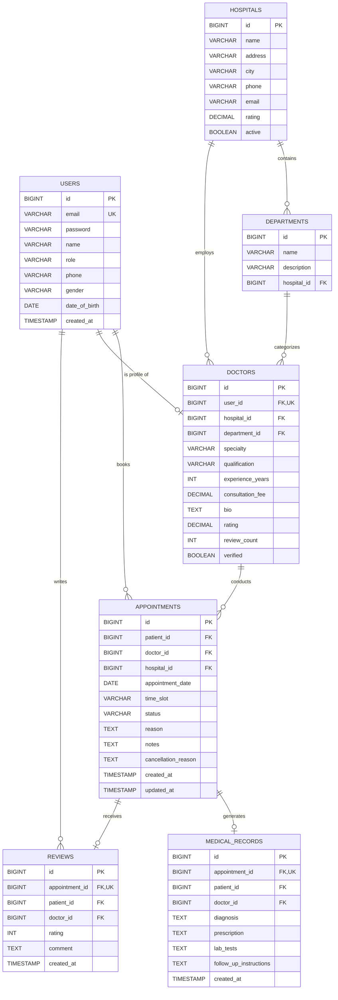

# Database Schema: MediConnect

## 1. Entity-Relationship Overview

---

## 2. Table Definitions & Constraints

### 2.1 `users`
- `id`: `BIGINT AUTO_INCREMENT PRIMARY KEY`
- `email`: `VARCHAR(150) NOT NULL UNIQUE`
- `password`: `VARCHAR(255) NOT NULL`
- `name`: `VARCHAR(100) NOT NULL`
- `role`: `VARCHAR(30) NOT NULL` (e.g. `ROLE_PATIENT`, `ROLE_DOCTOR`, `ROLE_ADMIN`)
- `phone`: `VARCHAR(20)`
- `gender`: `VARCHAR(15)`
- `date_of_birth`: `DATE`
- `created_at`: `TIMESTAMP DEFAULT CURRENT_TIMESTAMP`

### 2.2 `hospitals`
- `id`: `BIGINT AUTO_INCREMENT PRIMARY KEY`
- `name`: `VARCHAR(150) NOT NULL`
- `address`: `VARCHAR(255) NOT NULL`
- `city`: `VARCHAR(100) NOT NULL`
- `phone`: `VARCHAR(20)`
- `email`: `VARCHAR(120)`
- `rating`: `DECIMAL(3,2) DEFAULT 4.5`
- `active`: `BOOLEAN DEFAULT TRUE`

### 2.3 `doctors`
- `id`: `BIGINT AUTO_INCREMENT PRIMARY KEY`
- `user_id`: `BIGINT NOT NULL UNIQUE REFERENCES users(id) ON DELETE CASCADE`
- `hospital_id`: `BIGINT REFERENCES hospitals(id)`
- `department_id`: `BIGINT REFERENCES departments(id)`
- `specialty`: `VARCHAR(100) NOT NULL`
- `qualification`: `VARCHAR(150)`
- `experience_years`: `INTEGER DEFAULT 0`
- `consultation_fee`: `DECIMAL(10,2) NOT NULL`
- `bio`: `TEXT`
- `rating`: `DECIMAL(3,2) DEFAULT 5.0`
- `review_count`: `INTEGER DEFAULT 0`
- `verified`: `BOOLEAN DEFAULT FALSE`

### 2.4 `appointments`
- `id`: `BIGINT AUTO_INCREMENT PRIMARY KEY`
- `patient_id`: `BIGINT NOT NULL REFERENCES users(id)`
- `doctor_id`: `BIGINT NOT NULL REFERENCES doctors(id)`
- `hospital_id`: `BIGINT REFERENCES hospitals(id)`
- `appointment_date`: `DATE NOT NULL`
- `time_slot`: `VARCHAR(30) NOT NULL`
- `status`: `VARCHAR(30) NOT NULL` (`PENDING`, `CONFIRMED`, `COMPLETED`, `CANCELLED`)
- `reason`: `TEXT`
- `notes`: `TEXT`
- `cancellation_reason`: `TEXT`
- `created_at`: `TIMESTAMP DEFAULT CURRENT_TIMESTAMP`
- `updated_at`: `TIMESTAMP DEFAULT CURRENT_TIMESTAMP`

---

## 3. Indexes & Optimizations
- `idx_appointment_date_doctor`: `(doctor_id, appointment_date, time_slot)` for preventing double booking.
- `idx_doctor_specialty_city`: `(specialty, hospital_id)` for quick doctor directory searches.
- `idx_appointment_patient`: `(patient_id, status)` for fast patient dashboard queries.
